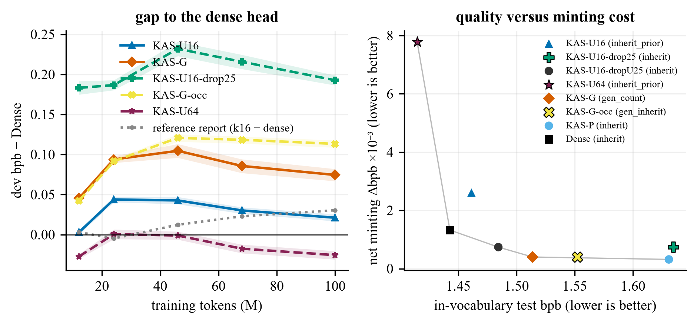
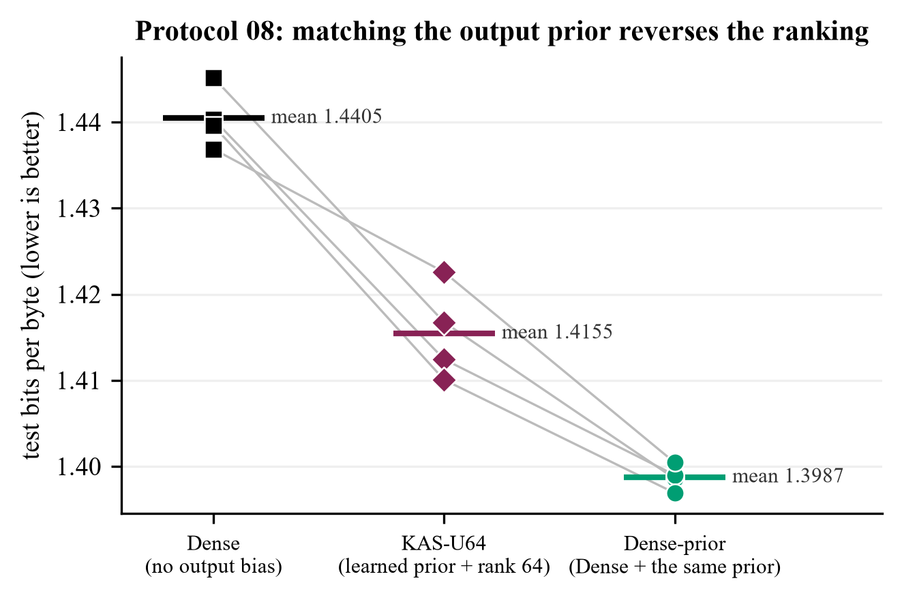
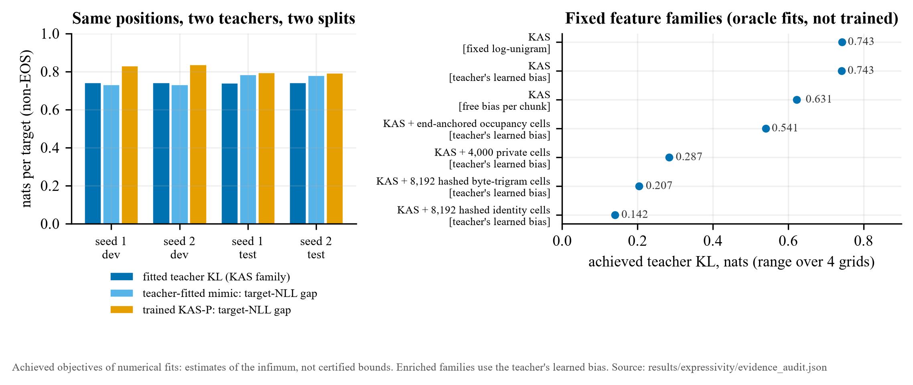

# Kronecker byte-derived output heads

A controlled study of whether a language model's output head can be derived from the bytes of each token
instead of being learned as a vocabulary-sized matrix, and what that costs.

The starting point is the Kronecker embedding: a fixed, deterministic code that writes a token's bytes into a
256 × 32 byte-by-position grid. Because the code is linear in that grid, an output head can compute one score per
grid cell from the hidden state and give each token the sum of its cells' scores. Such a head has no
vocabulary-dependent parameters and can score byte strings it never saw in training. I tested how close heads of
this family come to an ordinary dense head, which per-token additions recover the difference, and whether the
answer depends on giving the comparison heads the same prior information.

All trained models are GPT-style decoders (8 layers × 512) trained for 100M tokens of FineWeb-Edu with GPT-2 BPE,
evaluated in bits per byte (BPB) on a held-out test split. Every experimental phase was governed by a protocol
written before its runs ([`protocols/`](protocols/)).

I started this work about a month after the original deadline, so other participants' solutions and the later
consolidated write-up were already available when I began. I didn't want to ignore that work or just re-run it.
Instead I took it as the starting point and tried to push the questions further with my own controlled
experiments, follow-up tests, failure analysis and extra controls, which is how this grew into the larger study
in this repository.

## Summary

1. **No byte-derived head beats a dense head that has the same frequency prior.** The best byte-derived head
   (KAS-U64: additive head, learned log-unigram bias, stored rank-64 per-token correction) reaches 1.4155 test
   BPB over four seeds. A dense head with the same trainable log-unigram bias reaches 1.3987, ahead on every seed.
2. **The one apparent win came from an unequal comparison.** Against a dense head *without* an output bias,
   KAS-U64 was ahead in all eight runs (four seeds per arm). The KAS-U heads had a per-token bias initialised from
   training-set unigram counts; the dense comparator had none. Giving the dense head that bias and changing
   nothing else reversed the ranking.
3. **A correction generated from spelling recovers most of a stored correction's gain, but mostly not through
   spelling.** A small shared network that writes each token's correction from its bytes recovers 0.69 of the
   gain of a stored rank-16 table. The same network reading a fixed *other* token's bytes still recovers 0.61.
4. **Heads that store more per token are better on in-vocabulary text and worse at adding new tokens.** Stored,
   generated and dropout-trained corrections lie on one quality-versus-minting trade-off.
5. **The fixed feature family is far from a strong model's predictions.** Fitting the exact feature family of the
   additive head with a fixed log-unigram prior (KAS-P) to the full next-token distributions of two trained
   dense teachers leaves about 0.74 nats of KL per position, on both the development and the test split. This is
   a teacher-relative measurement of a relaxed family, not a lower bound on true language-model loss, and it
   applies established projection mathematics to this specific codec.
6. **Parameters stop growing with the vocabulary; compute does not.** The additive head keeps 4,194,304
   parameters at any vocabulary size, but it still scores and normalises over every token.

## Background

**The codec.** The Kronecker embedding ([Shravan 2026, arXiv 2605.29459](https://arxiv.org/abs/2605.29459);
reference implementation [`kronecker-embeddings`](https://github.com/theschoolofai/kronecker-embeddings)) maps
a token's bytes to occupied cells of a 256 × 32 grid, scales by token length and normalises. This repository
re-implements it in [`src/kq5/codec.py`](src/kq5/codec.py) and tests it against the published package
(agreement better than 2e-4).

**The additive (KAS) head.** If `κ_v` is token `v`'s code and `h` the final hidden state, a head with logits
`κ_v · (W_out h)` needs only one shared 8,192 × 512 matrix. It is exactly a dense head whose rows are the fixed
codes multiplied by `W_out`. This Kronecker additive softmax head was derived by Subramanya Naik and,
independently, by Dattatreya Manjunath (see [Prior work](#prior-work-and-attribution)).

**Per-token additions.** The heads in this study add terms to the KAS logit:

    logit_v(h) = KAS_v(h) + β_v + ⟨u_v, C·h⟩

| Name | What it adds | Vocabulary-sized trainable parameters |
|---|---|---|
| KAS-0 | nothing | 0 |
| KAS-P | fixed log-unigram prior `β_v` | 0 |
| KAS-U16 / KAS-U64 | learned `β_v` (initialised to the log-unigram prior) and a stored rank-16 / rank-64 correction `u_v` | 17 or 65 per token |
| KAS-G | `u_v` generated from the token's bytes by one shared ByteCNN | 0 |
| KAS-G-shuf | as KAS-G, but the generator reads a fixed other token's bytes | 0 |
| Dense | untied `d × V` head on the same Kronecker input, no output bias | `d` per token |
| Dense-prior | Dense plus the same trainable log-unigram bias as KAS-U | `d + 1` per token |

The prior, the stored rank-k correction (called K2 below) and vocabulary dropout come from an unpublished
lecture report, *The Vocabulary-Free Output Head* (the "reference report" below), which also stated the
trade-off tested here: every per-token
parameter that closes the quality gap takes away the ability to score new words. KAS-U16 is my
re-implementation of K2 from the report's description.

**Minting** means adding a token at inference time. Here it was measured on 1,000 frequent word-internal merges
held out of training: in bits per occurrence relative to each model's own two-token path (regret), in probability
leaked to the new tokens where they are wrong, and in BPB on re-tokenised test text.

## Experiments

| Phase | Protocol | Runs | Question |
|---|---|---|---|
| Pilot | [01](protocols/01_r1_smoke.md), [02](protocols/02_r2_pilot.md) | smoke tests, 21M-token pilot | learning rates, generator choice, defects |
| Phase 1 | [03](protocols/03_r3_canonical.md), [03a](protocols/03a_errata.md), [03b](protocols/03b_amendment_after_pilot.md), [04](protocols/04_modal_exploratory.md), [05](protocols/05_amendment_modal_canonical.md) | 14 canonical runs (7 arms × 2 seeds), all replicated on a second GPU type | stored versus generated corrections, minting, frequency structure |
| Phase 2 | [06](protocols/06_phase2_later_informed_controls.md), [06a](protocols/06a_amendment_dropout_target.md) | 8 runs | vocabulary dropout, the report's byte-computed correction, rank 64 |
| Phase 3 | [07](protocols/07_confirmation_u64_vs_dense.md) | 4 runs (fresh seeds 3 and 4) | does KAS-U64's lead over Dense replicate? |
| Phase 4 | [08](protocols/08_prior_matched_dense.md) | 4 runs | does it survive a dense head with the same prior? |
| Analysis | — | no training | teacher-referenced expressivity of the fixed feature family |

Training used 100,007,936 tokens per run (one pass, identical window order for every arm and seed), AdamW at
lr 1e-3 with cosine decay, and a 57,243-token vocabulary (GPT-2 BPE plus 7,000 word-internal merges). Intervals
are paired two-level bootstraps over evaluation windows and seeds unless stated. Details, every verdict and the
negative results are in [docs/EXPERIMENTS.md](docs/EXPERIMENTS.md).

## Results

### Every trained head

Test BPB, seed means, from `results/phase4/analysis_m3_p2_p3_p4_test.json`. "Added in" is the governing
protocol.

<!-- table:arms -->
| Arm | Added in | What differs | Seeds | Test BPB | Δ vs Dense-prior | Head params | V-dependent head params |
|---|---|---|---:|---:|---:|---:|---:|
| **Dense-prior** | P08 | Dense + trainable per-token bias initialised to log-unigram counts | 4 | 1.3987 | — | 29,365,659 | 29,365,659 |
| **KAS-U64** | P06a, P07 | KAS + learned prior + stored rank-64 correction | 4 | 1.4155 | +0.0167 | 7,947,900 | 3,720,795 |
| **Dense** | P03, P07 | untied d x V head on the same Kronecker input; no output bias | 4 | 1.4405 | +0.0418 | 29,308,416 | 29,308,416 |
| KAS-U16 | P03 | KAS + learned prior + stored rank-16 correction (K2 re-implemented) | 2 | 1.4613 | +0.0625 | 5,175,660 | 973,131 |
| KAS-U16-dropU25 | P06a | KAS-U16; each step 25% of tokens lose u_v (vocabulary dropout) | 2 | 1.4844 | +0.0856 | 5,175,660 | 973,131 |
| KAS-G | P03 | KAS + prior + correction generated from bytes by a shared ByteCNN | 2 | 1.5138 | +0.1151 | 4,954,418 | 0 |
| KAS-G-shuf | P03 | KAS-G, generator reads a fixed other token's bytes | 2 | 1.5279 | +0.1291 | 4,954,418 | 0 |
| KAS-G-occ | P06 | KAS-G with the reference report's occupancy-MLP generator | 2 | 1.5522 | +0.1535 | 4,957,866 | 0 |
| KAS-U16 (c_zero) | P03 (ablation) | KAS-U16 with the broken C = 0 initialisation | 2 | 1.5830 | +0.1843 | 5,175,660 | 973,131 |
| **KAS-P** | P03 | KAS + fixed log-unigram prior; no per-token trainable term | 2 | 1.6308 | +0.2321 | 4,194,337 | 0 |
| KAS-U16-drop25 | P06 | KAS-U16; each step 25% of tokens lose beta_v and u_v | 2 | 1.6347 | +0.2360 | 5,175,660 | 973,131 |
| KAS-0 | P03 | Kronecker additive head (KAS) alone | 2 | 1.9398 | +0.5410 | 4,194,337 | 0 |
<!-- /table:arms -->

Reading from the bottom: a fixed log-unigram prior alone (KAS-0 to KAS-P) is worth 0.31 BPB, per-token
corrections recover most of the rest, and the best byte-derived head still trails the prior-matched dense head
while using 27% of its head parameters.

### Generated versus stored corrections

Phase 1 asked whether the stored correction's gain needs stored per-token parameters at all. A ByteCNN that
generates each token's correction from its bytes recovers ρ = 0.690 [0.661, 0.718] of the stored rank-16
correction's gain (pre-registered threshold 0.5). The shuffled-spelling control, which gives the same network a
fixed other token's bytes, recovers 0.61. Real spelling adds only 0.0141 BPB [0.0083, 0.0200] on
in-vocabulary text. A shared network with any fixed per-token input can memorise part of a per-token table, so
most of the recovery is not orthographic generalisation.

Spelling does matter when the generator writes a *new* token's parameters from its bytes (an exploratory minting
rule), and generated parameters lose less relative to each model's own two-token path. In absolute terms the
stored-correction model still gives new tokens more probability. At 100M tokens, adding the held-out merges cost
bits for every head, because word-internal merges shorten the test text by only 0.18%.

Phase 2 tested three claims of the reference report under the same recipe. Its own byte-computed correction, which
it reported as 0.24 BPB worse than no correction, was 0.0786 BPB better than no correction here. Vocabulary
dropout reproduced the report's +0.028 BPB cost only when the stored correction alone was hidden (+0.0231), a
reading chosen after the first one failed; hiding the prior as well cost the whole correction (+0.1734). A rank-64
stored correction, which the report could not train, trained normally.



*Figure 8 (Phase 2, before the prior-matched control). Left: dev-BPB gap to the bias-free dense head during
training. Right: in-vocabulary test BPB against net minting cost. Heads that store more per token sit to the
left and higher.*

### The rank-64 result and the prior-matched control

In Phase 2, KAS-U64 was 0.0281 BPB below the bias-free dense head on two seeds. Protocol 07 repeated the
comparison on two fresh seed pairs with frozen configurations: every KAS-U64 run was still below every Dense run,
with a smaller margin (0.0250 over four seeds, bootstrap [−0.0314, −0.0187]). The pre-registered verdict was
WEAKENED, because the two-seed Welch interval on the fresh pairs included zero.

After Phase 3, an independent review of the code pointed out a confound, which I confirmed in the code before
running anything else. Every KAS-U head has a trainable per-token bias initialised to the
centred log-unigram counts of the training split; the dense comparator had no output bias, and the backbone has
no biases anywhere. KAS-U64's lead could be frequency information rather than the structured head. Protocol 08
repeated the four Dense runs with that bias added: same seeds (so every other weight starts bit-identical), same
optimiser group as KAS-U's bias, nothing else changed.

<!-- table:protocol08 -->
| Seed | Dense | Dense-prior | KAS-U64 | Dense − Dense-prior | KAS-U64 − Dense-prior |
|---|---:|---:|---:|---:|---:|
| 1 | 1.4452 | 1.3986 | 1.4168 | +0.0466 | +0.0182 |
| 2 | 1.4403 | 1.3990 | 1.4124 | +0.0413 | +0.0134 |
| 3 | 1.4396 | 1.3969 | 1.4101 | +0.0427 | +0.0131 |
| 4 | 1.4369 | 1.4004 | 1.4226 | +0.0364 | +0.0221 |
| **mean** | **1.4405** | **1.3987** | **1.4155** | **+0.0418** | **+0.0167** |

Dense − Dense-prior: paired t (df 3) [+0.0351, +0.0484]. KAS-U64 − Dense-prior: two-level bootstrap [+0.0114, +0.0224], Welch (df ≈ 3.4) [+0.0083, +0.0252]. KAS-U64 is lower in 0 of 16 (seed, seed) pairs. Share of the earlier KAS-U64-vs-Dense gap removed by giving Dense the bias: 1.67 [1.37, 2.18]. Source: `results/phase4/prior_verdict.json`.
<!-- /table:protocol08 -->



*Figure 9. Test BPB of every run in the prior-matched comparison; grey lines join runs with the same seed.*

The bias explains more than the whole earlier gap. The Phase 1–3 numbers are still correct as comparisons with
the bias-free dense head, but the structured rank-64 design is not shown to beat a dense head with matched prior
information. Two qualifications remain. The intervention bundles count information with a trainable intercept,
and the two were not separated. KAS-U64 is still better than Dense-prior on rare tokens: an independent
recomputation from the saved per-position losses puts the contribution of tokens with training count below 1,000
at −0.002980 BPB in KAS-U64's favour, against +0.019701 BPB elsewhere. Losses from separately trained models
cannot be spliced into one normalised model, so this is a description of where the models differ, not an
achievable gain.

### How far is the fixed feature family from a strong model?

KAS-P is 0.2321 BPB behind Dense-prior. The trained models cannot say whether a better body or more training
would close that gap, or whether the head's fixed feature space is itself far from what a strong model predicts.
To measure the second possibility, I wrote KAS-P's logit as an affine function of a fixed feature matrix (1,787
features: 1,753 occupied codec cells weighted by the codec's length gain, a length-scaled total and 33 length
indicators; numerical rank 1,333) and fitted the best member of that family to each position's full next-token
distribution from two Dense-prior teachers. The fit gives every position its own coefficients, so it is a
relaxation of the trained head. No model was trained for this analysis.

<!-- table:projection -->
| Teacher / split | Non-EOS targets | Fitted teacher KL (fixed log-unigram bias) | Mimic target-NLL gap | Realised KAS-P gap | KAS-P minus mimic |
|---|---:|---:|---:|---:|---:|
| seed 1 / dev | 4,091 | 0.742673 | 0.732321 | 0.830475 | 0.098108 |
| seed 2 / dev | 4,091 | 0.743360 | 0.732049 | 0.837669 | 0.105650 |
| seed 1 / test | 4,092 | 0.741189 | 0.785448 | 0.795471 | 0.010001 |
| seed 2 / test | 4,092 | 0.741865 | 0.780921 | 0.792246 | 0.011305 |
<!-- /table:projection -->

Nats per non-EOS target position on a fixed grid of 32 windows × 128 positions per split. *Fitted teacher KL*:
the achieved objective of the fit. *Mimic gap*: target NLL of the fitted distribution minus the teacher's.
*Realised KAS-P gap*: the trained KAS-P (seed 1) minus the teacher, on the same positions.

The best fits found stay about 0.74 nats from either teacher on either split. On the same positions the trained
KAS-P's target NLL is 0.10 nats (dev) and 0.01 nats (test) above that of the fitted member of its family. These
measurements are consistent with a substantial structural mismatch between the codec's feature space and these
teachers. They are not a decomposition of the language-model gap into representation and optimisation, they are
relative to these teachers rather than to the true distribution, and 0.74 is an achieved numerical objective,
not a certified bound. Adding fixed features (end-anchored cells, hashed trigrams, private cells for frequent
tokens, hashed identity cells) lowers the achieved KL substantially, but those are oracle fits with the teacher's
own bias, not trained heads. Full method, caveats and the feature-family screen are in
[docs/EXPRESSIVITY.md](docs/EXPRESSIVITY.md).



*Figure 10. Left: the table above. Right: achieved teacher KL of richer fixed feature families (fits, not
trained models).*

### Vocabulary size

At V = 1,048,576 the KAS head would keep 4,194,304 parameters against 536,870,912 for a dense head. One forward
and backward pass of the head over 8,192 positions took 0.95 s for KAS and 0.83 s for the dense head at that
vocabulary size (0.048 s for KAS at V = 50,257): the softmax still enumerates every token. Growing the vocabulary
with real candidate tokens to 779,181 entries cost every head bits on dev text.

## Limitations

* One backbone (8 × 512), one corpus (English FineWeb-Edu), 100M tokens per run, GPT-2 BPE. Two seeds per arm,
  four for Dense, KAS-U64 and Dense-prior. No arm was tuned beyond a shared learning-rate probe; the dense heads
  were never tuned, and the Dense-prior bias settings were copied from KAS-U.
* Minting was measured on frequent word-internal merges held out of training, not on genuinely unseen words.
  Vocabulary growth reached 779,181 real candidates, not 1M.
* The prior-matched control does not separate count information from a trainable per-token intercept.
* The expressivity analysis uses two teachers of one architecture, one trained KAS-P comparator, and a
  deterministic grid of 4,096 positions per split. Fitted objectives are numerical estimates without
  certificates, and the richer families had only a four-position convergence check.
* KAS-U16 re-implements the reference report's design from its description; the report's code and model were not
  available.

## Reproducing the results

Every reported number is computed from files in [`results/`](results/) and the per-run records in
[`experiments/`](experiments/). Two checks need nothing beyond this repository:

```bash
python -m pip install -r requirements.txt
```

```bash
python -m pytest -q tests
```

```bash
python scripts/build_summary.py --check
```

The tests check the codec against the published implementation, the head equivalences, the metrics and the
protocol 08 bias-only difference (seven of them need the GPT-2 `tokenizer.json`, which the data step downloads).
`build_summary.py --check` regenerates every table marked as generated in this README and in `docs/` from the
saved results and fails if any differs. Re-running the analyses from per-position losses needs the token streams
(rebuilt by `scripts/prepare_data.py`, about 0.5 GB); retraining needs a GPU (about 8 to 10 minutes per run on
one RTX PRO 6000). [docs/REPRODUCE.md](docs/REPRODUCE.md) has every command.

## Repository layout

| Path | Content |
|---|---|
| [`src/kq5/`](src/kq5/) | codec, vocabulary and merges, model, output heads (`heads.py`), generators, training, evaluation, minting, vocabulary growth |
| [`tests/`](tests/) | CPU unit tests |
| [`scripts/`](scripts/) | data preparation, training launchers (Modal, Kaggle), analyses, figures, summary tables |
| [`scripts/expressivity/`](scripts/expressivity/) | teacher-projection fits and their audit |
| [`configs/jobs/`](configs/jobs/), [`kaggle/`](kaggle/) | job specifications and the exact scripts that ran the pilot and the T4 replication |
| [`protocols/`](protocols/) | pre-registered protocols and amendments |
| [`experiments/`](experiments/) | per-run configuration records, training curves, per-position NLL arrays and per-run analyses (no checkpoints) |
| [`results/`](results/) | analysis outputs per phase, expressivity fits, generated summary tables |
| [`figures/`](figures/) | figures 1 to 10 |
| [`notebooks/`](notebooks/) | Phase 1 and Phase 2 analyses from saved results |
| [`docs/`](docs/) | [EXPERIMENTS.md](docs/EXPERIMENTS.md), [EXPRESSIVITY.md](docs/EXPRESSIVITY.md), [REPRODUCE.md](docs/REPRODUCE.md) |

## Prior work and attribution

This project did not invent the mechanisms it tests. Its contributions are the controlled multi-seed comparison
of stored, generated and dropout-trained corrections with minting measured in bits, the prior-matched control and
the reversal it produced, and the codec-specific teacher-referenced measurement.

* **Problem and codec.** The question (can reversing the Kronecker codec remove the output head and allow a
  very large vocabulary?) was posed as an open problem in The School of AI's ERA V5 course. The codec is
  Rohan Shravan's Kronecker embedding ([arXiv 2605.29459](https://arxiv.org/abs/2605.29459), The School of AI).
* **The additive head.** Subramanya Naik derived the gather-and-sum (KAS) head and its exact equivalence to a
  dense head with code-derived rows; Dattatreya Manjunath derived it independently. Other course participants'
  work informed the framing: Mukund Singh (static inversion versus distributional prediction; GPT-2 fragment
  tokens must be read as raw bytes, not decoded), Anusha Raju (the rank bottleneck of the code matrix; rank 1,333
  here, which does not bind at width 512), and Yasir Reshi, Swati Bansal, Avnish Midha, Deepjyoti Saha, Aneesha
  Das and Ramesh on byte-level decoders and hybrids.
* **K2 and the trade-off.** The log-unigram bias, the stored rank-k correction, vocabulary dropout, the
  occupancy-MLP correction and the quality-versus-new-word trade-off are from the course's unpublished lecture
  report *The Vocabulary-Free Output Head*, which consolidated participants' submissions with the instructor's
  own experiments. Phase 1 was designed with those designs already known.
* **Literature.** Character-derived output rows with a learned per-word correction predate all of this
  ([Jozefowicz et al. 2016](https://arxiv.org/abs/1602.02410), CNN softmax). Count-initialised output biases are
  studied by [Meister et al. 2023](https://aclanthology.org/2023.acl-short.22/), close prior art for the
  protocol 08 intervention. The projection used in the expressivity analysis is fixed-embedding softmax
  projection ([Ganea et al. 2019](https://proceedings.mlr.press/v97/ganea19a.html), section 3(b)), related to
  log-linear outputs over fixed attributes ([Dymetman & Xiao 2016](https://arxiv.org/abs/1607.02467)) and the
  softmax bottleneck ([Yang et al. 2018](https://arxiv.org/abs/1711.03953);
  [Godey et al. 2024](https://arxiv.org/abs/2404.07647)). Training-free initialisation of new tokens is related to
  [Hewitt (2021)](https://www.cs.columbia.edu/~johnhew/vocab-expansion.html) and
  [Minixhofer et al. 2024](https://arxiv.org/abs/2405.07883). Further references are in the documents under
  `docs/`.
