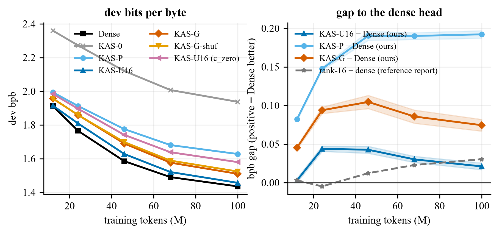
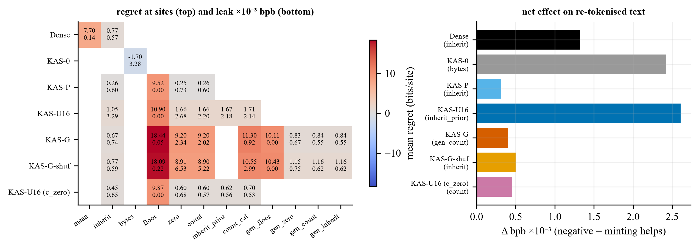
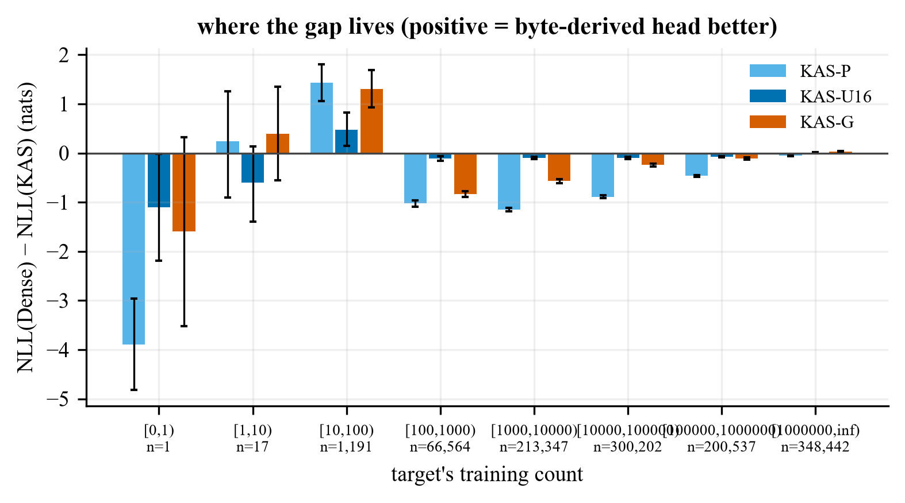
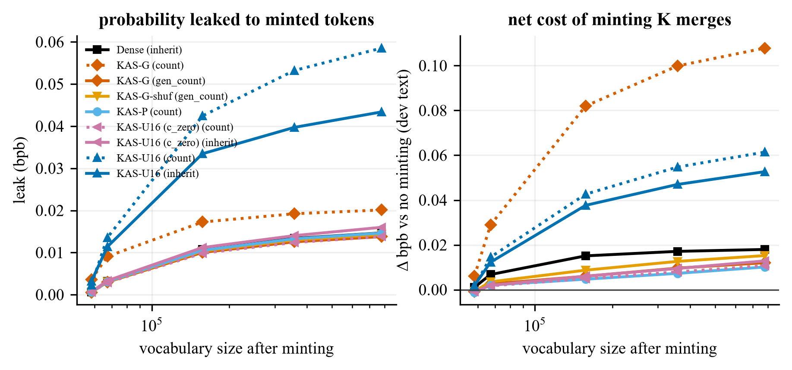
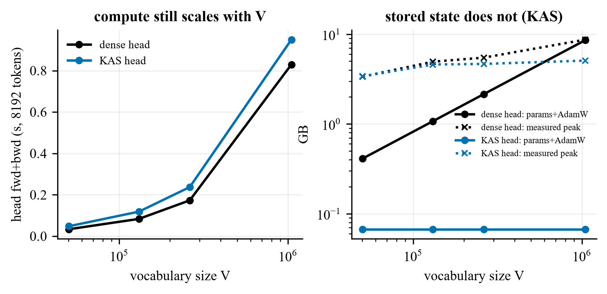

# Experiments: setup, verdicts and results

This document covers the trained models: the setup shared by every run, the pre-registered questions and their
verdicts, the results of each phase, and the negative results and deviations. The teacher-referenced analysis of
the fixed feature family is in [EXPRESSIVITY.md](EXPRESSIVITY.md); commands are in [REPRODUCE.md](REPRODUCE.md).
Head names are defined in the [README](../README.md#background).

Unless stated otherwise, numbers are test-split bits per byte (BPB), seed means, and intervals are 95% paired
two-level bootstraps (evaluation windows paired across arms, seeds resampled within arms). "Dense" always means
the dense head without an output bias; "Dense-prior" is the dense head with the trainable log-unigram bias added
in protocol 08.

## 1. Setup

**Data.** FineWeb-Edu `sample-10BT`, streamed in published order. Documents are split by a hash of their id into
train / dev / test (243,560 / 1,220 / 1,220 documents). Frequency tables, merges and growth candidates come from
the training split only. Dev was used for selection; test was read once per protocol, at the end. Two test
documents (0.12% of test tokens) duplicate training documents under other ids.

**Vocabulary.** GPT-2 BPE on raw token bytes (never `tokenizer.decode`, which maps fragments of multi-byte
characters to U+FFFD). GPT-2's 14 tokens longer than 32 bytes would collide under the codec, so they are removed
and their occurrences re-encoded losslessly, leaving 50,243 base tokens. Merge candidates are word-internal
adjacent pairs ranked by training count; of the top 8,000, one in eight ranks is held out at random. That gives
7,000 trained merges (training vocabulary 57,243, EOS included) and 1,000 held-out merges that never occur as
tokens in training. The trained merges shorten the training text by 1.50%. Training tokens: 247,268,406;
dev 1,225,678; test 1,131,839. Held-out merge sites: dev 2,299 (646 distinct merges), test 2,110 (617 distinct).

**Model.** GPT backbone, 8 layers × 512, 8 heads, context 1,024, pre-LayerNorm, GELU, no biases. Input: the
reference Kronecker codec (256 × 32 grid, length scaling, per-token z-normalisation; matches the published
`kronecker-embeddings` 0.1.1 to < 2e-4) and one learned projection. Every head materialises its rows once per
step and scores `h·Eᵀ + b`, so all arms pay the same logit compute.

| Arm | total params | head params | V-dependent head params |
|---|---:|---:|---:|
| Dense | 59,201,536 | 29,308,416 | 29,308,416 |
| Dense-prior | 59,258,779 | 29,365,659 | 29,365,659 |
| KAS-0 / KAS-P | 34,087,457 | 4,194,337 | 0 |
| KAS-U16 | 35,068,780 | 5,175,660 | 973,131 |
| KAS-U64 | 37,841,020 | 7,947,900 | 3,720,795 |
| KAS-G / KAS-G-shuf (ByteCNN v3) | 34,847,538 | 4,954,418 | 0 |

**Training.** 100,007,936 tokens per canonical run (1,526 steps × 64 × 1,024), one pass, the same window order
for every arm and seed (seeds change initialisation only). AdamW, lr 1e-3, cosine decay to 10%, weight decay 0.1,
fp16 autocast with the loss in fp32. Byte-derived head matrices train at lr × 0.1 (chosen in the smoke test,
where × 1 diverged); head and non-head gradients are clipped separately. Per-token biases are in a separate group
at lr × 1 without weight decay.

**Hardware.** The pilot ran on Kaggle (two Tesla T4 workers per kernel). Every canonical, Phase 2, 3 and 4 run ran
on Modal on one NVIDIA RTX PRO 6000 with the same torch build (decided in protocol 05 before any canonical
result). All 14 Phase 1 configurations were also run on Kaggle T4s as a replication.

**Arm codes in file names.** `dense`, `densep` (Dense-prior), `kas0`, `kasp`, `kasu` (KAS-U16 with the broken
`c_zero` initialisation), `kasu0` (canonical KAS-U16, `u_zero` initialisation), `kasu64`, `kasg`, `kasgshuf`,
`kasg-occ`, `kasu-drop25`, `kasu-dropu25`. Run sets: `m3` (Phase 1), `p2`, `p3`, `p4`; `r1`/`r2` pilot;
`r3` T4 replication.

## 2. Pre-registered questions and verdicts

Each verdict rule was fixed in the protocol named in the second column before the runs it judges. Amendment 06a
was written after the first Phase 2 results had been seen, so its prediction is post hoc in a way the others are
not.

<!-- table:verdicts -->
| ID | Protocol | Question | Key number (test, 95% interval) | Pre-registered verdict |
|---|---|---|---|---|
| H1 | P03 | Does a correction generated from bytes recover ≥ 0.5 of a stored rank-16 correction's gain? | ρ = 0.690 [+0.661, +0.718] | SUPPORTED |
| H2 | P03 | Do generated parameters mint held-out merges with lower regret than stored ones? | Δregret −0.377 [−0.543, −0.200] bits/site | SUPPORTED (relative cost only) |
| H3 | P03 | Does the byte head's deficit change sign across frequency buckets? | Spearman ρ = 0.143 | INCONCLUSIVE |
| H4 | P03 | Does the minting advantage need real spelling (selected rule)? | −0.099 [−0.246, +0.052] bits/site | REJECTED |
| K2 | P03 | Does Dense's lead over KAS-U16 grow from 12M to 100M tokens (dev)? | +0.0029 → +0.0211 BPB | REPRODUCED |
| Q1/H5 | P06 | Vocabulary dropout of prior and correction: quality cost; minting | +0.1734 [+0.1680, +0.1789] BPB | costly; H5 SUPPORTED |
| Q1/H5′ | P06a | Vocabulary dropout of the correction only (post-hoc reading) | +0.0231 [+0.0207, +0.0254] BPB | H5′ SUPPORTED |
| H7 | P06 | Does the reference report's negative result for byte-computed coordinates replicate? | KAS-P − KAS-G-occ +0.0786 [+0.0773, +0.0797] BPB (report: −0.24) | DOES NOT REPLICATE |
| H8 | P06/06a | Does a rank-64 stored correction train (and how does it compare with bias-free Dense)? | KAS-U64 − Dense −0.0281 [−0.0337, −0.0229] BPB (2 seeds) | TRAINS |
| P07 | P07 | Does KAS-U64 < bias-free Dense hold on fresh seeds 3 and 4? | −0.0219 BPB; Welch [−0.0883, +0.0444] | WEAKENED |
| P08 | P08 | Does KAS-U64 still beat Dense once Dense gets the same log-unigram bias? | KAS-U64 − Dense-prior +0.0167 [+0.0114, +0.0224] BPB | band D: prior-matched Dense beats KAS-U64 |
<!-- /table:verdicts -->

## 3. Phase 1: stored versus generated corrections

Phase 1 asked whether the reference report's trade-off is fundamental or an artefact of *storing* the
correction instead of computing it from the token's bytes. Hypotheses (protocol 03):

* **H1:** [BPB(KAS-P) − BPB(KAS-G)] / [BPB(KAS-P) − BPB(KAS-U16)] ≥ 0.5.
* **H2:** on held-out merges, minting regret is lower under KAS-G than under KAS-U16 with its best training-free
  rule (paired interval excludes zero; leak no worse).
* **H3:** NLL(Dense) − NLL(KAS) changes sign across training-frequency buckets.
* **H4:** with spellings shuffled for the generator, the H2 advantage vanishes.

| Arm | test BPB (seed mean) | seeds |
|---|---:|---|
| Dense | 1.4427 | 1.4452, 1.4403 |
| KAS-U16 | 1.4613 | 1.4608, 1.4618 |
| KAS-G | 1.5138 | 1.5181, 1.5095 |
| KAS-G-shuf | 1.5279 | 1.5293, 1.5265 |
| KAS-U16 (c_zero) | 1.5830 | 1.5828, 1.5832 |
| KAS-P | 1.6308 | 1.6307, 1.6308 |
| KAS-0 | 1.9398 | 1.9396, 1.9399 |

Source: `results/final/analysis_m3_test.json`. Paired differences: KAS-P − KAS-U16 +0.1695 [+0.1678, +0.1711];
KAS-P − KAS-G +0.1170 [+0.1119, +0.1220]; KAS-G-shuf − KAS-G +0.0141 [+0.0083, +0.0200]; KAS-U16 − Dense +0.0185
[+0.0138, +0.0231]; KAS-0 − KAS-P +0.3090 [+0.3071, +0.3108]. Largest seed spread 0.0086 (KAS-G).

**H1, supported.** ρ = 0.690 [0.661, 0.718]. The shuffled-spelling generator recovers +0.1029 [+0.1007, +0.1051]
BPB, 0.61 of the stored gain. A derangement still gives every token a unique input, so the shuffled generator
can memorise part of a per-token table in its 751,889 weights; the control matches parameters and compute, not
memorisation. Most of the recovery does not need real spelling.

**H2, supported (relative cost only).** With rules chosen on dev by regret (`inherit` for both), regret(KAS-G) −
regret(KAS-U16) = −0.377 [−0.543, −0.200] bits per site over 2,110 test sites; leak difference −0.00255
[−0.00269, −0.00242] BPB. Regret is each model's cost for the minted token minus its own two-token cost, so it
measures how much a model loses by minting. In absolute terms a minted token costs KAS-G 14.75 bits and KAS-U16
14.00 bits per site (difference +0.75 [+0.58, +0.93]); H2's lower regret comes from KAS-U16's better two-token
baseline (12.95 against 14.08 bits).

**H4, rejected under the selected rule.** regret(KAS-G) − regret(KAS-G-shuf) = −0.099 [−0.246, +0.052] bits per
site. The selected rule copies the prefix's parameters and never reads the new token's bytes, so it cannot see
spelling. Under the exploratory `gen_count` rule, where the generator writes the new token's parameters from its
bytes, KAS-G − KAS-G-shuf is −0.32 [−0.47, −0.16] bits per site: spelling helps there. Feeding the generator
another held-out merge's bytes raises the generated rule's regret from 0.839 to 2.538 bits per site.

**H3, inconclusive.** NLL(Dense) − NLL(KAS-U16) per target, by training count (positive means the byte-derived
head is better): [10,100) +0.471 nats [+0.148, +0.822]; [100,1000) −0.108; [1000,10000) −0.099;
[10000,100000) −0.099; [100000,1000000) −0.075; [1000000,inf) +0.012 [+0.004, +0.019]. The byte-derived head is
better on rare tokens and very slightly on the most frequent ones, so the sign changes twice (Spearman ρ = +0.143).

**K2 pattern.** Dense's dev lead over KAS-U16 grows from +0.0029 [+0.0002, +0.0057] at 12M tokens to +0.0211
[+0.0168, +0.0255] at 100M, as the reference report found. The shape differs: here the gap peaks between 24M and
46M tokens and narrows afterwards.

**Replication.** All 14 runs were repeated on Kaggle T4s with the same data, seeds and evaluation windows
(`results/replication/kaggle_vs_modal.json`, training-side test BPB only). Arm order is identical; per-run test
BPB differs by −0.0022 to +0.0047 except one KAS-0 seed (+0.0111), and every paired gap agrees within 0.0057 BPB
(H1 ratio 0.690 against 0.690).

**What the stored table holds.** On held-out tokens, spelling predicts KAS-U16's learned correction in output
space with R² 0.336 (ridge on the code), 0.352 (ByteCNN) and 0.379 (both); shuffled spellings predict nothing
(`results/probe/u_probe.json`, exploratory, one run). Weighted by training count R² is negative (−0.16): the
probe captures rare and mid-frequency rows, not the frequent tokens that dominate the loss. Removing the
correction costs KAS-U16 0.366 BPB, KAS-G 0.287 and KAS-G-shuf 0.248. Before training, bytes explained at most
0.284 of held-out log-frequency variance and 0.121 of public GPT-2's output-row variance (`results/r0b/r0b.json`).

## 4. Minting, vocabulary growth and cost

Re-tokenising the test text with the 1,000 held-out merges shortens it by only 0.18%, and at 100M tokens minting
them costs bits for every head (Δ BPB × 10⁻³ on identical text, seed mean): KAS-P (`count`) +0.317, KAS-G
(`gen_count`) +0.400, KAS-G (`inherit`) +0.564, Dense (`inherit`) +1.325, KAS-0 +2.424, KAS-U16 (`count`) +2.626,
KAS-U16 (`inherit`) +3.464. The held-out merges are frequent two-token strings in training, not unseen words.

Growing the vocabulary to 779,181 tokens with real candidates (dev text, seed 1, 256 windows), Δ BPB against no
minting: KAS-G +0.0120, KAS-P +0.0101, Dense +0.0180, KAS-U16 +0.0527, KAS-U64 +0.1059, KAS-0 +0.4600.

At V = 1,048,576 the KAS head keeps 4,194,304 parameters (67 MB of FP32 weights, gradients and AdamW moments)
against 536,870,912 for a dense head (8.6 GB), but head forward plus backward over 8,192 positions takes 0.95 s
(KAS) against 0.83 s (dense), and 0.048 s for KAS at V = 50,257. On a T4 the v3 generator took 29% of each KAS-G
training step at V = 57,243; it runs over every vocabulary entry, so it scales with V as well.

## 5. Phase 2: claims of the reference report under the same recipe

Four arms, each the canonical KAS-U16 or KAS-G configuration with one change (protocol 06; amendment 06a for
the second dropout arm and the second rank-64 seed). Hardware was chosen by a short throughput probe under a rule
fixed in the protocol (`results/phase2/gpu_probe.json`).

| Arm | change | test BPB | seeds |
|---|---|---:|---|
| KAS-U16-drop25 | each step a random 25% of tokens lose `β_v` and `u_v` | 1.6347 | 1.6381, 1.6313 |
| KAS-U16-dropU25 | as above, but only `u_v` is hidden | 1.4844 | 1.4826, 1.4861 |
| KAS-G-occ | the report's generator form `W₂ tanh(W₁ κ_v + b₁) + b₂` on the 8,192-dim code, parameter-matched | 1.5522 | 1.5519, 1.5525 |
| KAS-U64 | stored correction of rank 64 | 1.4146 | 1.4168, 1.4124 |

**Vocabulary dropout of prior and correction.** BPB(KAS-U16-drop25) − BPB(KAS-U16) = +0.1734 [+0.1680, +0.1789],
indistinguishable from no correction (KAS-P − KAS-U16-drop25 = −0.0039 [−0.0098, +0.0021]). The stored table
still learned (removing it costs 0.7831 BPB), but hiding a frequent token's prior moves its logit by several nats,
so the head learned to carry frequency through the byte path and to use the stored rows to undo that. Minting
improved (H5 supported: regret −2.591 [−2.959, −2.251] bits per site under each arm's dev-selected rule, leak no
worse), but KAS-G is better on both axes (H6 dominated).

**Dropout of the correction only.** +0.0231 [+0.0207, +0.0254] BPB, close to the report's +0.028 at 20M tokens.
The head uses its stored rows about half as much (ablation 0.1721 against 0.3656 BPB). Leak to minted tokens
falls 3.63×, and net re-tokenised minting cost falls from +2.607 to +0.739 × 10⁻³ BPB, still above KAS-G's
+0.400. Regret under the `zero` rule did not improve (+0.0549 [−0.1097, +0.2180]), so a row-less token is not a
more familiar state for this head; the simpler reading is that the head relies less on its stored rows. This
reading was chosen after the first one failed.

**The report's byte-computed correction (H7).** BPB(KAS-P) − BPB(KAS-G-occ) = +0.0786 [+0.0773, +0.0797]; it
recovers 0.4635 [0.4577, 0.4689] of the stored gain (the ByteCNN: 0.690). The report measured −0.24 for this form
at 20M tokens. The ByteCNN is better by 0.0384 [0.0336, 0.0433] BPB, and even the ByteCNN reading shuffled
spellings beats the occupancy MLP reading real ones by 0.0243 [0.0224, 0.0263]: generator capacity and form
matter more than the spelling it reads. Whether the report's result holds under its own training (20M tokens,
6 × 768, unpublished initialisation) was not tested.

**Rank 64 (H8).** It trains under `u_zero` and is 0.0467 [0.0439, 0.0495] BPB below KAS-U16. At the time it was
also 0.0281 [0.0229, 0.0337] below the bias-free Dense on two seeds, with 3.69× fewer head parameters. It mints
worst of every head: net re-tokenised +7.788 × 10⁻³ BPB, leak 0.00855 BPB under `inherit`, growth to 779,181
tokens +0.1059. Section 7 shows what the comparison with Dense left out.

### Quality versus minting

Rule chosen on dev by net re-tokenised Δ BPB (`results/phase2/phase2_verdicts.json`); growth from
`results/phase2/growth_summary.json` (dev, seed 1).

| Arm | rule | in-vocabulary test BPB | net minting Δ BPB × 10⁻³ | growth to 779,181: Δ BPB |
|---|---|---:|---:|---:|
| KAS-U64 | inherit_prior | 1.4146 | +7.788 | +0.1059 |
| Dense | inherit | 1.4427 | +1.325 | +0.0180 |
| KAS-U16 | inherit_prior | 1.4613 | +2.607 | +0.0527 |
| KAS-U16-dropU25 | inherit | 1.4844 | +0.739 | +0.0199 |
| KAS-G | gen_count | 1.5138 | +0.400 | +0.0120 |
| KAS-G-occ | gen_inherit | 1.5522 | +0.403 | +0.0137 |
| KAS-P | inherit | 1.6308 | +0.317 | +0.0101 |
| KAS-U16-drop25 | inherit | 1.6347 | +0.744 | +0.0119 |

The heads lie on one curve from a stored rank-64 correction (lowest BPB, worst minting) through Dense, the
dropout-trained stored head and the generated head to no correction. The net minting axis has no confidence
interval (it is a seed mean of a whole-text quantity), and two dominance relations are within noise. After
protocol 08, Dense-prior sits below every point on the BPB axis and mints like Dense (net +1.41 × 10⁻³ under
`inherit`, four-seed mean).

## 6. Phase 3: confirmation of KAS-U64 against Dense

The rank-64 result came out of a broader search, and its second seed was added after the first had been seen
below Dense. Protocol 07 froze both configurations and trained fresh pairs with seeds 3 and 4 on the same data,
order, budget, recipe, evaluation windows, torch build and hardware.

| seed | Dense | KAS-U64 | KAS-U64 − Dense |
|---|---:|---:|---:|
| 1 | 1.4452 | 1.4168 | −0.0284 |
| 2 | 1.4403 | 1.4124 | −0.0279 |
| 3 (fresh) | 1.4396 | 1.4101 | −0.0295 |
| 4 (fresh) | 1.4369 | 1.4226 | −0.0143 |

Fresh pairs: Δ = −0.0219, bootstrap [−0.0304, −0.0135], Welch (df ≈ 1.1) [−0.0883, +0.0444]. All four seeds:
Δ = −0.0250, bootstrap [−0.0314, −0.0187], Welch [−0.0333, −0.0167]; KAS-U64 lower in 16 of 16 seed pairs. The
rule required both fresh-pair intervals to exclude zero for CONFIRMED; the two-seed Welch interval did not, so
the verdict was WEAKENED (`results/phase3/confirm_verdict.json`).

## 7. Phase 4: prior-matched Dense

**Why.** Every KAS-U head has a trainable per-token bias `β_v` initialised to the centred log-unigram counts of
the training split (`src/kq5/heads.py`; lr × 1, no weight decay). The Dense comparator had no output bias of any
kind, and the backbone and final LayerNorm have none either. The frequency-bucket decomposition of
Dense − KAS-U64 put about 92% of the summed NLL difference in tokens with training count below 100,000, which is
what either a per-token prior or parameter sharing would produce. No Dense arm with a bias existed. Protocol 08
records the decision and the outcome bands before launch; the prediction at the time (the bias would explain
about a fifth of the gap) was wrong.

**Arm.** Dense-prior (`p4-densep-s1..4`): the four Dense configurations with `dense_bias = True`, i.e.
`logit_v(h) = ⟨W_v, h⟩ + β_v` with `β_v` initialised and optimised exactly as KAS-U's. The bias is created after
`W` is drawn, so for each seed every other weight starts bit-identical to the Dense run
(`tests/test_prior_matched.py`). KAS-U64 was not retrained.

<!-- table:protocol08 -->
| Seed | Dense | Dense-prior | KAS-U64 | Dense − Dense-prior | KAS-U64 − Dense-prior |
|---|---:|---:|---:|---:|---:|
| 1 | 1.4452 | 1.3986 | 1.4168 | +0.0466 | +0.0182 |
| 2 | 1.4403 | 1.3990 | 1.4124 | +0.0413 | +0.0134 |
| 3 | 1.4396 | 1.3969 | 1.4101 | +0.0427 | +0.0131 |
| 4 | 1.4369 | 1.4004 | 1.4226 | +0.0364 | +0.0221 |
| **mean** | **1.4405** | **1.3987** | **1.4155** | **+0.0418** | **+0.0167** |

Dense − Dense-prior: paired t (df 3) [+0.0351, +0.0484]. KAS-U64 − Dense-prior: two-level bootstrap [+0.0114, +0.0224], Welch (df ≈ 3.4) [+0.0083, +0.0252]. KAS-U64 is lower in 0 of 16 (seed, seed) pairs. Share of the earlier KAS-U64-vs-Dense gap removed by giving Dense the bias: 1.67 [1.37, 2.18]. Source: `results/phase4/prior_verdict.json`.
<!-- /table:protocol08 -->

* The bias helps Dense by 0.0418 BPB, and KAS-U64 is 0.0167 behind the prior-matched Dense (pre-registered
  band D). Every Dense-prior run is below every KAS-U64 run, which is below every Dense run.
* It is not a head start: on dev, Dense-prior − Dense is −0.0679 at 12M tokens and −0.0423 at 100M; KAS-U64 −
  Dense-prior narrows from +0.0407 to +0.0196 but never closes.
* The bias helps where KAS-U64 did not. On tokens with training count in [10,100), the biased Dense is *worse*
  than Dense (NLL(Dense) − NLL(Dense-prior) = −0.350 nats [−0.416, −0.288]), while KAS-U64 was better there. 75% of
  the biased Dense's summed gain is below a training count of 100,000 (KAS-U64: 92%). The bias calibrates the
  bulk of the vocabulary, not the tail.
* Scored with its bias removed, the trained Dense-prior reaches 2.1627 BPB: the model builds on the bias. The
  bias stays near its initialisation (mean drift −0.031 nats) and carries 0.46 of the target-logit variance.
* Every KAS head is further behind Dense-prior than behind Dense (KAS-U16 +0.0625, KAS-G +0.1151, KAS-P
  +0.2321; `results/phase4/prior_verdict.json`).
* Dense-prior was not tuned either (bias settings copied from KAS-U), so 0.0418 is what this bias does in this
  recipe, not the best dense head.

An independent recomputation from the saved per-position test losses (`scripts/recompute_diagnostics.py`,
`results/phase4/independent_diagnostics.json`) reproduces the arm means and splits KAS-U64 − Dense-prior by
training count: tokens below 1,000 contribute −0.002980 BPB in KAS-U64's favour, everything else +0.019701.

## 8. Negative results and deviations

* **H4 rejected** under the dev-selected rule; spelling helps only under an exploratory rule that reads it.
* **H3 inconclusive**: the byte-derived head's deficit sits in mid-frequency tokens.
* **Minting did not pay at 100M tokens** for any head (the pilot at 20M saw small savings).
* **K2's 20M-token ordering did not reproduce in the pilot.** At 20.97M tokens Dense reached 1.8666 / 1.8707 dev
  BPB, KAS-U16 1.9255 / 1.9258 (`results/r2/summary.json`); the report found a tie at 20M.
* **The first KAS-U16 was broken.** Its stored table never learned: the trained U correlates 0.9997 with its
  random initialisation. Cause: C = 0 and U ~ N(0, 1), so Adam's steps of about lr leave U a frozen random
  projection. The canonical KAS-U and KAS-G heads use per-token u = 0 and random C (protocol 03b). The broken runs
  are reported as the ablation "KAS-U16 (c_zero)".
* **The pilot's generator gain was not spelling**: KAS-G (v1) and its shuffled control reached 1.8898 and 1.8899.
* **Vocabulary dropout of prior and correction** cost 0.1734 BPB, four to twelve times the protocol's prediction.
* **Rank 64 against Dense** reproduced in direction on fresh seeds but was then explained by the missing prior.
* An independent code review found seven analysis-side bugs before any canonical result; all are fixed or
  disclosed in `protocols/03a_errata.md`. The T4 replication's minting and growth analyses ran with pre-review
  code and are not used.

## 9. Limits

* One backbone, corpus, budget and tokenizer; two to four seeds per arm; fp16 mixed precision.
* KAS-U16 re-implements the report's K2 from its description; the report's model (d = 768) and code are
  unpublished. The KAS head here is untied and trains at lr × 0.1.
* Minting regret has a selection effect (sites are where the merged string occurs), so regret is reported with
  leak and net re-tokenised BPB.
* Generator v3 was chosen on the pilot under the old initialisation and not re-selected afterwards.
* No minting rule was tuned for any Phase 2 arm; growth was run on one seed per arm and not for Dense-prior.
* The code matrix of this vocabulary occupies 1,753 of 8,192 cells and has rank 1,333
  (`results/setup/code_rank_gpt2bpe.json`), so the byte-derived term of every KAS head lies in a
  1,333-dimensional subspace at any width. This does not bind at d = 512 but would above 1,333 + r.
